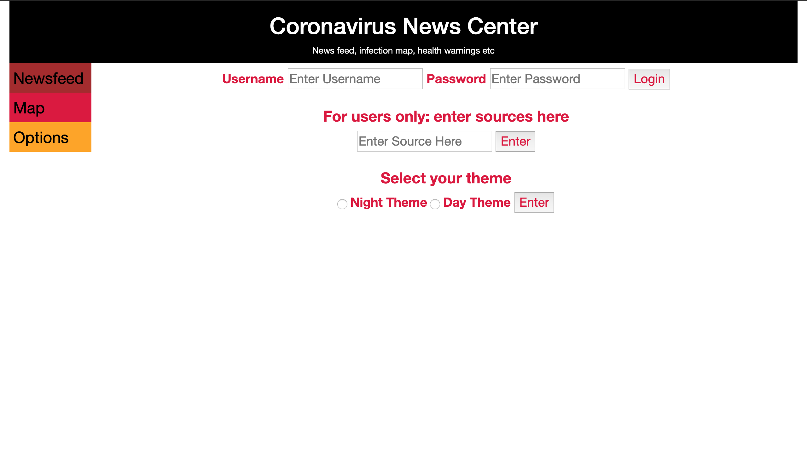
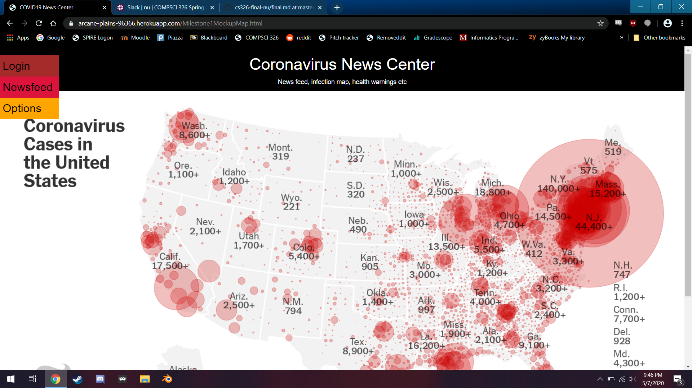
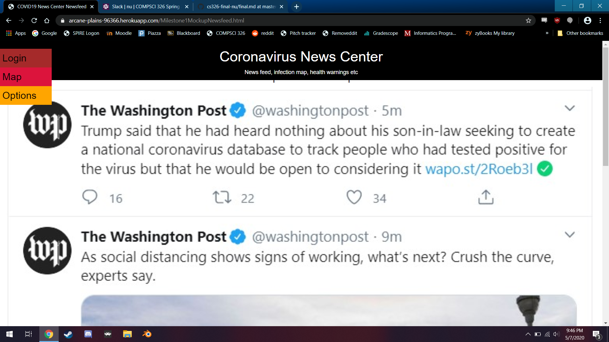

# Corona Watch by Team Nu
Spring 2020  

## Team
Julia Peterson ([jkpeterson](https://github.com/jkpeterson))  
Robert Powell ([ParsnipPizza](https://github.com/ParsnipPizza))    
Sheikh Noohery ([noohery](https://github.com/noohery))    

## Project Overview
Our web application helps people stay informed about the COVID-19 pandemic. It includes a news feed featuring recent articles about COVID-19 from a variety of sources. It also features a timeline showing the increases in cases in various selectable states on a map of the United States. This timeline also features articles about actions the governments of these states have taken and when.

## User Interface

A final up-to-date list/table describing your application’s user interface. This should include the name of the UI view and its purpose. You should include a screenshot of each of your UI views.

### View 1: Options Page

This page allows users to log-in to their account with their username and password. Here they can lookup sources to add to their custom newsfeed and switch between night and day theme. 

### View 2:

This page has a live map of coronavirus cases in the US, pulling from a major news outlet. Clicking on the link below allows users ot go to the source and see their data, additional breakdowns, etc.

### View 3: 

This has the currated news feed, its limited to the sources all users have, unless they have an account, in which they can add any source even if it isn't in the default list.

## APIs

Users with account can make these requests:
+ Enter username and password to log in
+ Add to their list of websites to grab headlines from
+ Select Dark or Light Mode

| Parameters    | Description  |
| ------------- |--------------|
| userName      | (Required) user's unique ID |
| websites      | List of websites the user retrieves headlines from |
| darkTheme     | True will change the website colors, false will have them remain normal |

## Database

The database holds the above information and associates it with a username, similar to the counter example completed in class.

## URL Routes/Mapping
/userId/addSource to add sources to a user's array
/userId/change theme to change from light to dark mode and vicer versa

## Division of Labor

for the entire project  

Julia Peterson: The wireframes, the backend code for the database and server, getting the project to function on heroku, bug fixes.

Robert Powell: Worked on mockup and later prototype HTML and CSS, helped with database connection and data types, deploying on Heroku

Sheikh Noohery: contributed to the database setup, main server, settings page html, and the markdown files for each milestones

## Conclusion

A conclusion describing your team’s experience in working on this project. This should include what you learned through the design and implementation process, the difficulties you encountered, what your team would have liked to know before starting the project that would have helped you later, and any other technical hurdles that your team encountered.

Julia Peterson:  This was a rather difficult project.  I had to learn Javascript with no prior knowledge this semester and then apply this new skill towards creating a final project.  These difficulties were also greatly amplified by pandemic.  Overall, I ended up doing a lot of work on the backend, both the database and the server, and this was very tricky and mostly new to me.  I had to often take the initiative to learn new things and do lots of research to complete what I needed to do.  This project felt a lot like the equivalent of being thrown into the deep end of a pool.  However, this wasn't all bad, it helped me to learn a lot and apply my skills in a way I otherwise never would have.  I wish that I could have had a more complete project at the end, but I think that myself and my teammates reached the limits of our abilities in some ways.  With more time and better circumstances, I think we definitely would have a better finished product.  However, given the circumstances I'm proud of the work I still managed to put in, and I'm thankful for my teammates, the TAs, and the professor for their support.

Robert Powell: This was already a little tricky before everyone had to go home, but eventually we ran into problems deploying, as well as adapting the given database and server code. I appreciated the effort Emery and the TAs took to smooth this obstacle over, its not their fault Zoom calls talking about connecting databases or website connections are less effective (Much like how we were unable to use authentication).  With more in-person/on campus help and time, I think we would have been able to implement far more of our features. This is not anything against our team, Julia and Noohery were great to work with, we were effective when things were working and made sense, and our general idea was a good one, with potential. I did learn a ton through this project: how to implement TS and JS, how to launch a project on Heroku along with the other concepts we learned in 326. Overall, good group, if given another chance in different circumstances, I think we'd have a much more finished result. As it is, I'm at least proud of how much our group did get accomplished, given our difficulties.

Sheikh Noohery: It was a bit stressful to work on the project from home due to COVID-19. However, I learned a lot from working on the project with my teammates. First, I learned how to use GitHub properly using the terminal. I have never used git before so that part of the experience was new for me. I also learned how to use bootstrap and will be using it every time I make an HTML page. The most difficult part for me and my teammates was the back-end. I wish we spent more time in class understanding how the different databases are manipulated with typescript. It was challenging to take what we learned in the class exercises and apply them to our database. Nevertheless, I can still create a basic MongoDB database, servers, and deploy apps on Heroku. Even though I found this project challenging, I learned a lot from working on it with Julia and Griffin.
