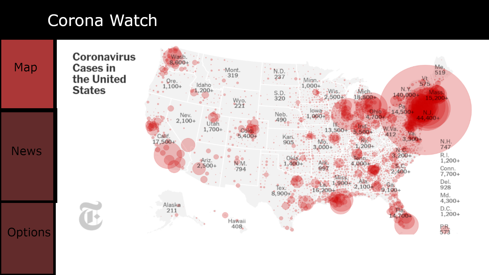
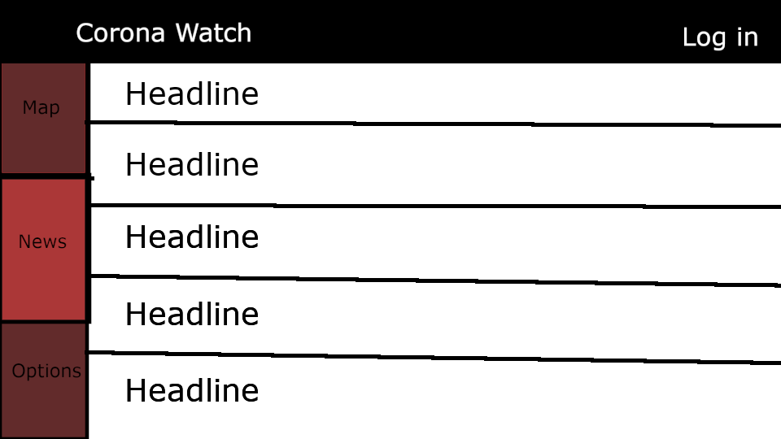
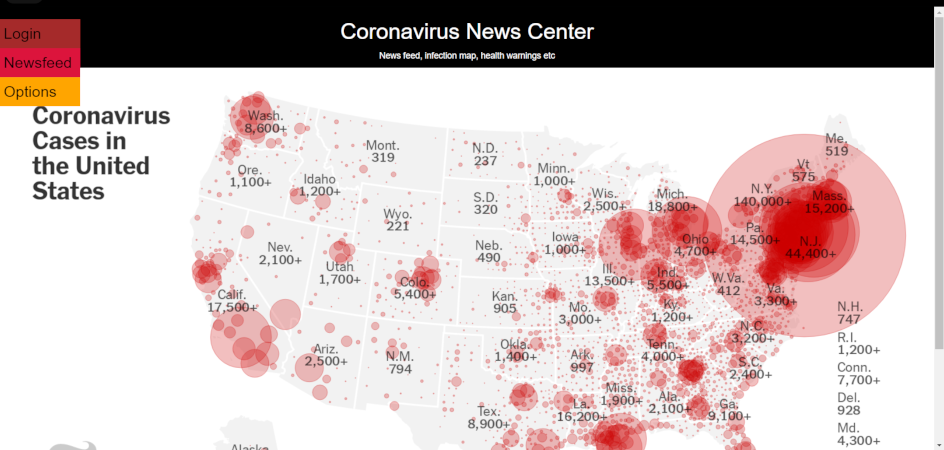
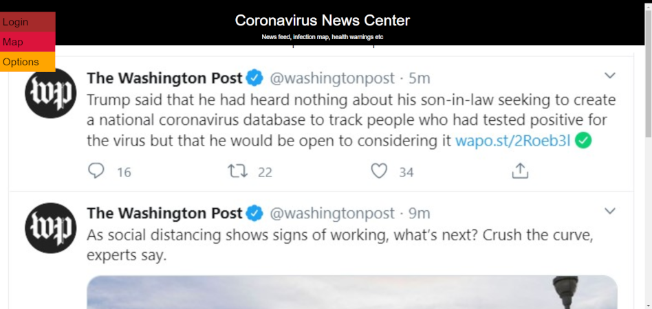

# Corona Watch by Team Nu

## Team Overview
Julia Peterson ([jkpeterson](https://github.com/jkpeterson))    
Robert Powell ([ParsnipPizza](https://github.com/ParsnipPizza))  
Sheikh Noohery ([noohery](https://github.com/noohery))  

## Important Components  
We are creating a website to that helps people stay informed about the COVID-19 pandemic. Our website will include a news feed featuring recent articles about COVID-19 from a variety of sources. It will also feature a timeline showing the increases in cases in various selectable states on a map of the United States. This timeline will also feature articles about actions the governments of these states have taken and when.

## Data Interactions  
The users of our website will interact with the data in the following ways:  
+ All regular users will view the default news feed and the timeline
+ An user with an account can: 
    - select custom news sources for their news feed
    - Set visual preferences 
        + custom themes
        + light mode/dark mode

## Wireframes  

## HTML and CSS  

## Labor Division
Julia Peterson - Wireframes, edits to HTML and CSS

Robert Powell - Main HTML and CSS dev

Sheikh Noohery - Data Interactions
